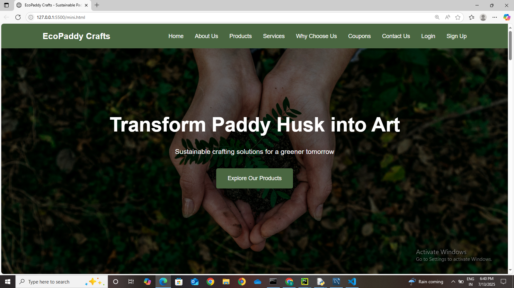

###🌾 Paddy Husk Crafting Products – Landing Page

This mini project is a **responsive landing page** built to promote eco-friendly **products made from paddy husk** — an agricultural byproduct that is often wasted. The landing page aims to create awareness about sustainable alternatives while providing a simple platform to showcase handcrafted items.

## 🎯 Objective

To **reduce agricultural waste** by promoting the creative reuse of paddy husk in crafting, and to **generate rural revenue** by supporting eco-based businesses. This project encourages sustainability and entrepreneurship through digital presence.

## 🔍 Key Features

- ✅ Clean and modern user interface  
- 📱 Fully responsive for desktop  
- ♻️ Promotes zero-waste and sustainability  
- 📦 Showcases handcrafted paddy husk products  
- 💰 Supports rural artisans and small-scale producers

## 💡 Why This Project?

Paddy husk is commonly discarded as waste after harvesting. This project demonstrates how such a natural byproduct can be turned into valuable, eco-conscious products. By creating a digital presence through a landing page, the project supports rural innovation, reduces environmental impact, and opens revenue channels for local communities.

## 🛠️ Tech Stack

- **HTML5**
- **CSS3**
- **JavaScript**

## 🚀 How to Run This Project

1. Clone this repository:

   ```bash
   git clone https://github.com/your-vimjamsamatha2018/mini_project.git
```

2. Navigate to the project folder:

   ```bash
   cd mini_project
   ```

3. Open `index.html` in your browser.

   Or, use a local server for live preview (optional):

   ```bash
   npx live-server
   ```

## 📸 Screenshot-HomePage Preview 



## 🙌 Contributing

Pull requests are welcome. For major changes, please open an issue first to discuss what you would like to change.

```

> 🔧 Replace `"your-username"` and `"your-repo-name"` with your GitHub details.  
> 📸 Place screenshots in a `/screenshots` folder in your repo and update image paths accordingly.  
> 📦 Let me know if you want a badge section or deploy it using GitHub Pages!


   

